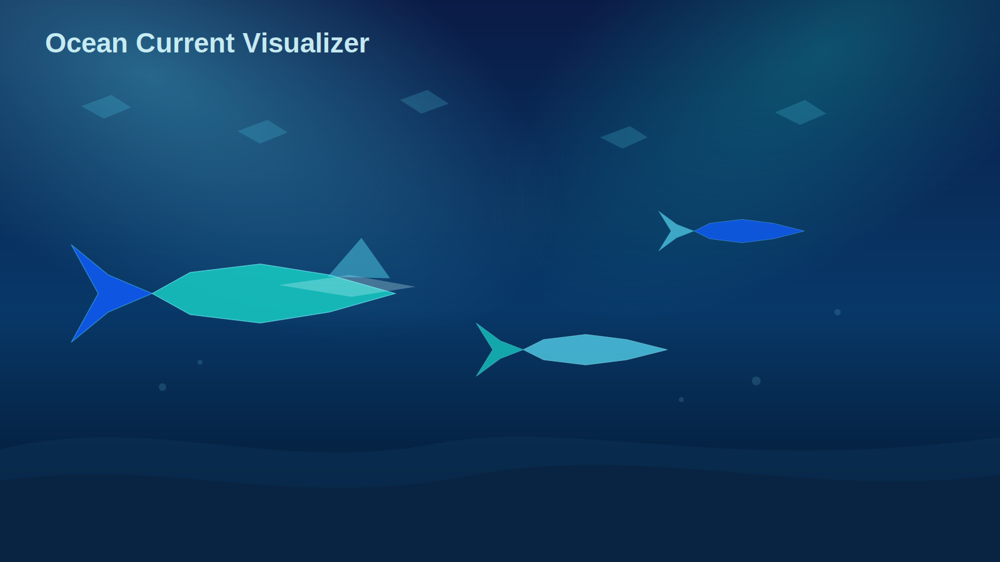
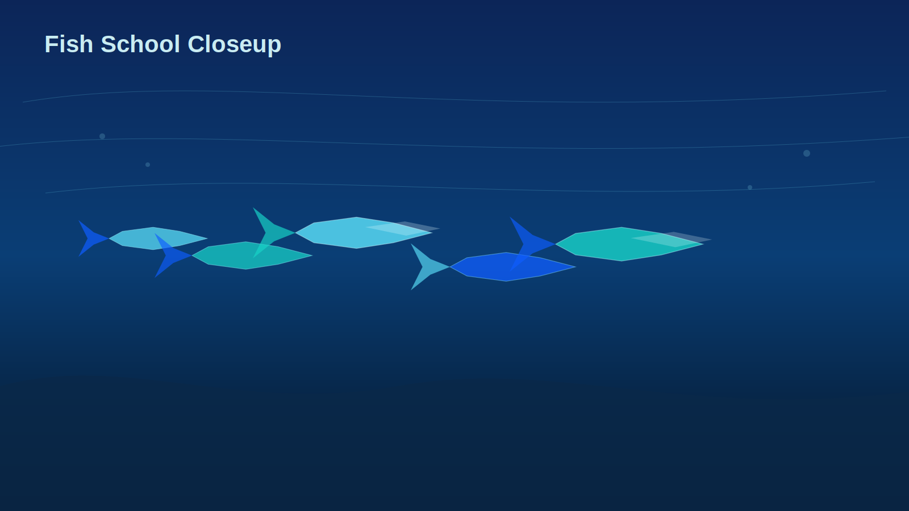
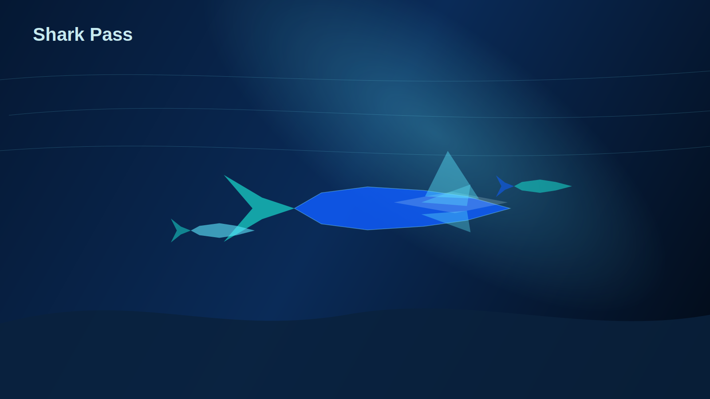

# Ocean Current Visualizer

A dynamic, audio-reactive underwater visualizer featuring fish schools, dolphins, and occasional sharks.

## Gallery

## Live

- [GitHub Pages](https://londyzoner-prog.github.io/visualizer/)
